# Projet de Traitement et d'Agrégation de Flux avec Kafka Streams

**Étudiant:** HYNDI ELMEHDI  
**Institution:** ENSET Mohammedia  
**Cours:** Traitement de flux de données massives (Big Data Stream Processing)  

Ce dépôt contient des exercices pratiques étape par étape démontrant l'utilisation d'Apache Kafka Streams pour le traitement de flux de données en temps réel, avec et sans état. Il couvre le nettoyage de texte, l'agrégation de télémétrie météorologique, et le suivi de clics sur un tableau de bord web à l'aide de Spring Boot et des requêtes interactives (Interactive Queries).

---

## Concepts clés de Kafka Streams expliqués

### 1. Qu'est-ce que Kafka Streams ?
Kafka Streams est une bibliothèque client permettant de créer des applications et des microservices dont les données d'entrée et de sortie sont stockées dans des clusters Kafka. Elle combine la simplicité de l'écriture d'applications Java/Scala standard côté client avec les avantages de la technologie de cluster Kafka côté serveur.

### 2. Qu'est-ce qu'un Serde (Sérialiseur/Désérialiseur) ?
Kafka ne comprend et ne transmet que des tableaux d'octets bruts (`byte[]`). Il ne comprend pas les classes Java ni les structures textuelles.
*   **Sérialiseur (Serializer):** Convertit un objet Java en un tableau d'octets avant de l'envoyer vers un topic Kafka.
*   **Désérialiseur (Deserializer):** Convertit un tableau d'octets brut lu depuis Kafka en un objet Java.
*   **Serde:** Une classe enveloppe qui regroupe à la fois un sérialiseur et un désérialiseur (par exemple, `Serdes.String()`).

### 3. Que sont les clés et valeurs dans les événements ?
Chaque message envoyé à Kafka est un couple de champs :
*   **Valeur (Le payload):** Le corps réel de l'événement (par exemple, une phrase textuelle, une mesure de température ou une action de clic).
*   **Clé (L'identifiant de routage / Métadonnées):** Un identifiant optionnel (par exemple, un identifiant de station, un identifiant d'utilisateur). Kafka utilise le hachage de la clé pour router les messages vers des partitions spécifiques, garantissant que tous les messages ayant la même clé sont traités dans l'ordre et peuvent être regroupés.

### 4. Traitement avec état vs. sans état
*   **Traitement sans état (Exercice 1):** Le traitement d'un message ne dépend d'aucun message précédent. Des opérations comme `filter()`, `mapValues()`, et `split().branch()` inspectent ou modifient chaque enregistrement individuellement.
    *   *Map vs. MapValues:* `map` permet de modifier à la fois la clé et la valeur (ce qui déclenche un repartitionnement/shuffle réseau). `mapValues` modifie uniquement la valeur, préservant la clé, ce qui évite les shuffles réseau coûteux.
*   **Traitement avec état (Exercices 2 & 3):** Le traitement dépend de l'historique. Des opérations comme `groupBy()`, `count()`, et `aggregate()` nécessitent une structure mémoire (State Store) pour maintenir les calculs cumulatifs en cours (sommes, décomptes, moyennes).

### 5. Magasins d'état & RocksDB
Les opérateurs avec état nécessitent un stockage local pour maintenir l'état (par exemple, la moyenne mobile d'une station météo). Kafka Streams gère cet état localement à l'aide d'une base de données clé-valeur intégrée appelée RocksDB, qui écrit des fichiers de point de contrôle (checkpoint) sur votre disque local.

### 6. Requêtes Interactives (Interactive Queries - Exercice 3)
Normalement, les résultats des requêtes doivent être réécrits dans un topic Kafka et lus par un consommateur. Les requêtes interactives vous permettent de traiter les magasins d'état locaux (RocksDB) de Kafka Streams comme des bases de données en lecture seule. Un contrôleur REST web peut directement interroger ces magasins en mémoire et renvoyer instantanément les valeurs via HTTP, sans lire à partir des topics.

---

## Configuration de l'infrastructure

Kafka est exécuté en arrière-plan à l'aide de Docker Compose.

### Démarrage de Zookeeper et du Broker Kafka
Exécutez la commande suivante à la racine du projet :
```bash
docker compose up -d
```

### Vérification de l'état des conteneurs
```bash
docker ps
```
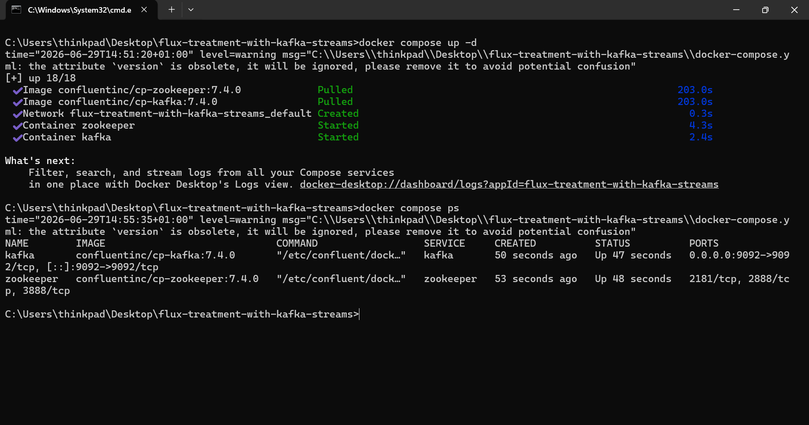

### Liste des topics actifs
Pour vérifier les topics actifs à l'intérieur du conteneur en cours d'exécution :
```bash
docker exec -it kafka kafka-topics --list --bootstrap-server localhost:9092
```
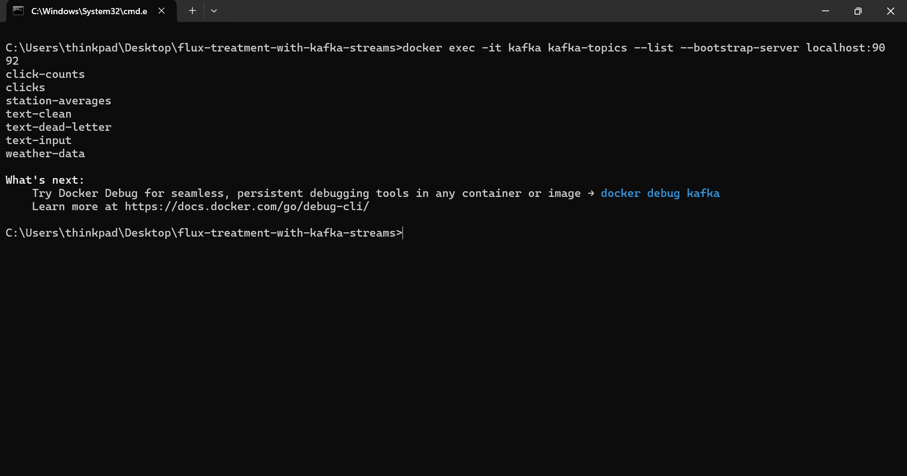

---

## ── Exercice 1 : Nettoyeur et Validateur de Texte ──

### 1. Flux de travail & Conception
Cet exercice utilise un traitement de flux sans état pour consommer du texte brut, le nettoyer, le valider et le router de manière dynamique.

*   **Processeur:** [TextCleanerApp.java](file:///c:/Users/thinkpad/Desktop/flux-treatment-with-kafka-streams/exercise-1-text-cleaner/src/main/java/ma/enset/exercise1/TextCleanerApp.java)
*   **Topic d'entrée:** `text-input`
*   **Topic de sortie (propre):** `text-clean`
*   **Topic de sortie (rejeté):** `text-dead-letter`

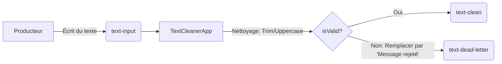

### 2. Comment exécuter
1.  Créer les topics :
    ```bash
    docker exec -it kafka kafka-topics --create --topic text-input --bootstrap-server localhost:9092 --partitions 1 --replication-factor 1
    docker exec -it kafka kafka-topics --create --topic text-clean --bootstrap-server localhost:9092 --partitions 1 --replication-factor 1
    docker exec -it kafka kafka-topics --create --topic text-dead-letter --bootstrap-server localhost:9092 --partitions 1 --replication-factor 1
    ```
    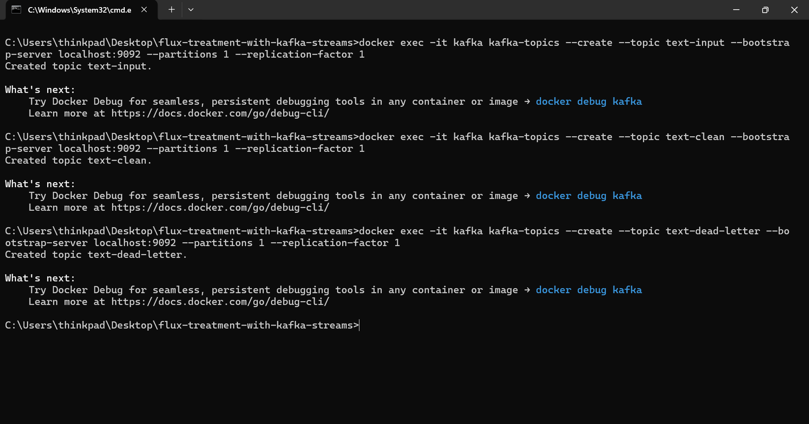
2.  Exécutez l'application [TextCleanerApp](file:///c:/Users/thinkpad/Desktop/flux-treatment-with-kafka-streams/exercise-1-text-cleaner/src/main/java/ma/enset/exercise1/TextCleanerApp.java) dans votre IDE.
3.  Ouvrez le **Terminal A (Producteur)** et envoyez du texte :
    ```bash
    docker exec -it kafka kafka-console-producer --topic text-input --bootstrap-server localhost:9092
    ```
    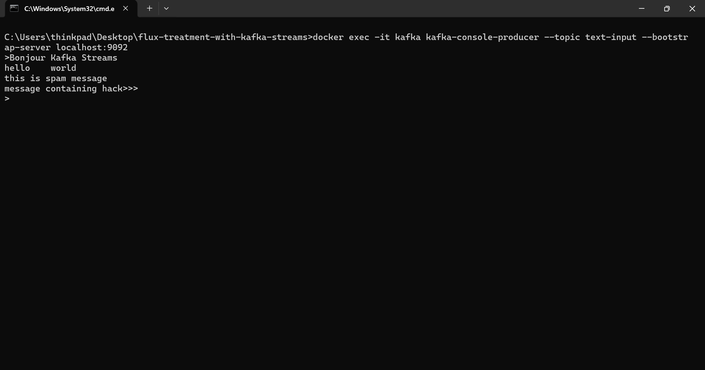
4.  Ouvrez le **Terminal B (Consommateur Propre)** :
    ```bash
    docker exec -it kafka kafka-console-consumer --topic text-clean --bootstrap-server localhost:9092 --from-beginning
    ```
    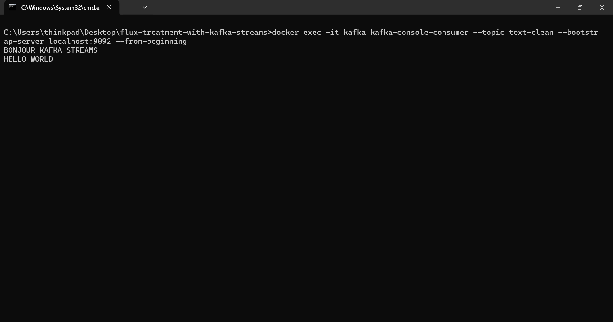
5.  Ouvrez le **Terminal C (Consommateur Rejet)** :
    ```bash
    docker exec -it kafka kafka-console-consumer --topic text-dead-letter --bootstrap-server localhost:9092 --from-beginning
    ```
    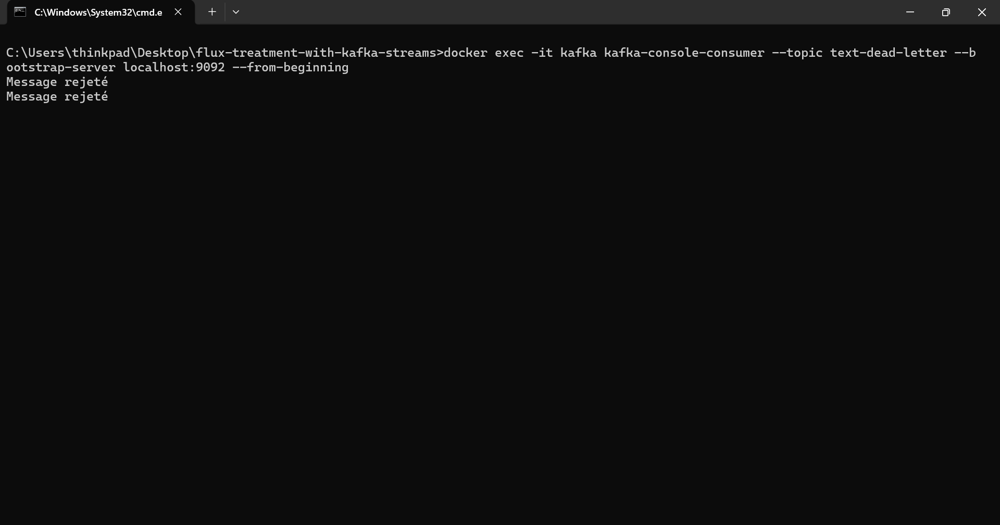

---

## ── Exercice 2 : Analyseur de Données Météorologiques ──

### 1. Flux de travail & Conception
Calcule les moyennes mobiles des températures (en Fahrenheit) et des humidités par station à l'aide d'une agrégation avec état et de sérialiseurs JSON personnalisés (Jackson).

*   **Processeur:** [WeatherAnalyzerApp.java](file:///c:/Users/thinkpad/Desktop/flux-treatment-with-kafka-streams/exercise-2-weather-analyzer/src/main/java/ma/enset/exercise2/WeatherAnalyzerApp.java)
*   **Modèles:** [WeatherRecord.java](file:///c:/Users/thinkpad/Desktop/flux-treatment-with-kafka-streams/exercise-2-weather-analyzer/src/main/java/ma/enset/exercise2/model/WeatherRecord.java) et [WeatherAverage.java](file:///c:/Users/thinkpad/Desktop/flux-treatment-with-kafka-streams/exercise-2-weather-analyzer/src/main/java/ma/enset/exercise2/model/WeatherAverage.java)
*   **Aide JSON Serde:** [JsonSerde.java](file:///c:/Users/thinkpad/Desktop/flux-treatment-with-kafka-streams/exercise-2-weather-analyzer/src/main/java/ma/enset/exercise2/serde/JsonSerde.java)
*   **Topic d'entrée:** `weather-data`
*   **Topic de sortie:** `station-averages`

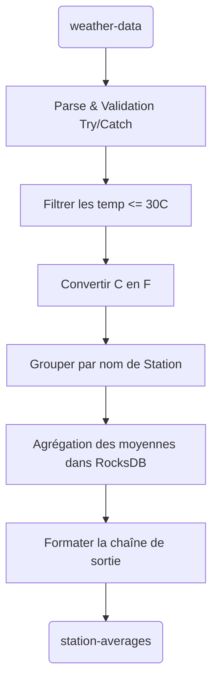

### 2. Comment exécuter
1.  Créer les topics :
    ```bash
    docker exec -it kafka kafka-topics --create --topic weather-data --bootstrap-server localhost:9092 --partitions 1 --replication-factor 1
    docker exec -it kafka kafka-topics --create --topic station-averages --bootstrap-server localhost:9092 --partitions 1 --replication-factor 1
    ```
    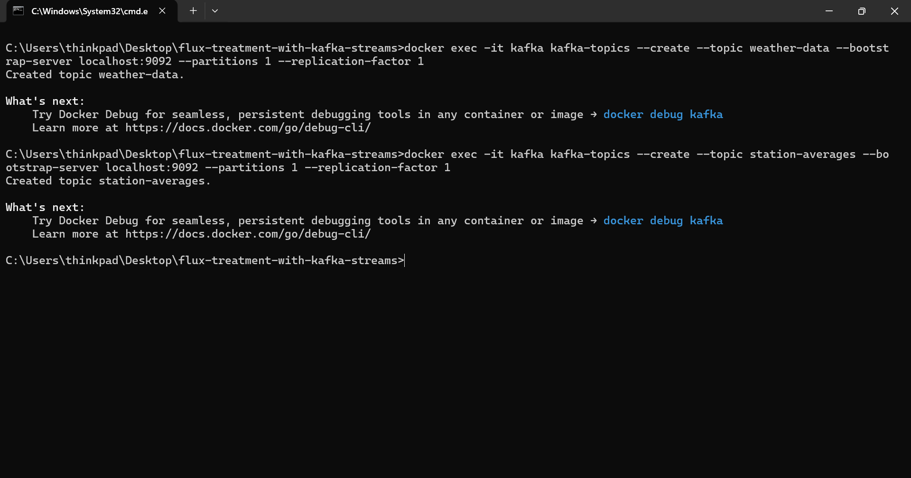
2.  Exécutez l'application [WeatherAnalyzerApp](file:///c:/Users/thinkpad/Desktop/flux-treatment-with-kafka-streams/exercise-2-weather-analyzer/src/main/java/ma/enset/exercise2/WeatherAnalyzerApp.java) dans votre IDE.
3.  Ouvrez le **Terminal A (Producteur Météo)** et envoyez des mesures CSV :
    ```bash
    docker exec -it kafka kafka-console-producer --topic weather-data --bootstrap-server localhost:9092
    ```
    *Exemples d'entrées :*
    ```text
    Station1,32.0,70
    Station2,35.0,50
    Station2,40.0,45
    Station1,28.0,60
    ```
    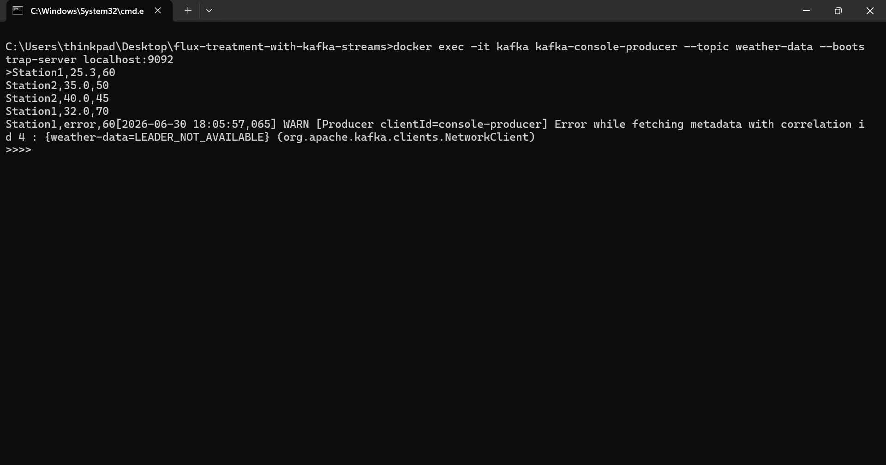
4.  Ouvrez le **Terminal B (Consommateur des moyennes)** :
    ```bash
    docker exec -it kafka kafka-console-consumer --topic station-averages --bootstrap-server localhost:9092 --from-beginning
    ```
    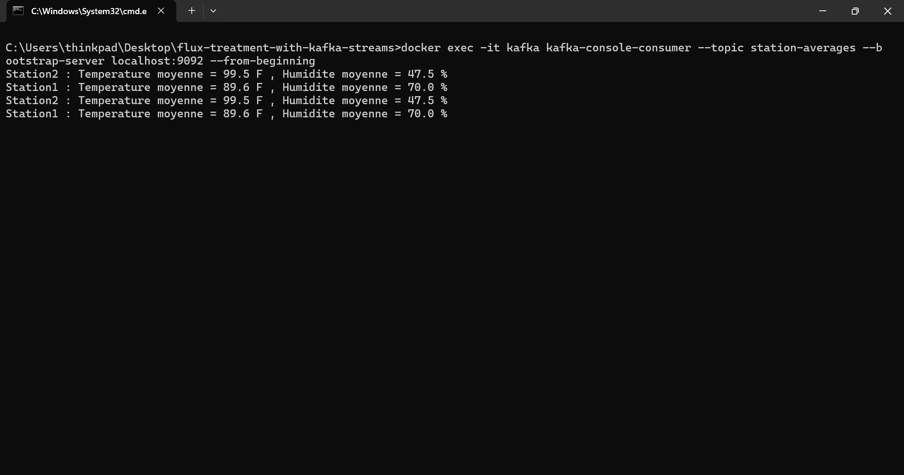

---

## ── Exercice 3 : Tableau de bord du compteur de clics ──

### 1. Flux de travail & Conception
Suit le nombre de clics globaux et par utilisateur en temps réel. Comprend une interface graphique web, un producteur REST pour publier les événements de clic, et un consommateur REST utilisant les requêtes interactives pour interroger directement les magasins RocksDB.

*   **Application de démarrage:** [ClickCounterApplication.java](file:///c:/Users/thinkpad/Desktop/flux-treatment-with-kafka-streams/exercise-3-click-counter/src/main/java/ma/enset/exercise3/ClickCounterApplication.java)
*   **Config & Topologie des flux:** [KafkaStreamsConfig.java](file:///c:/Users/thinkpad/Desktop/flux-treatment-with-kafka-streams/exercise-3-click-counter/src/main/java/ma/enset/exercise3/config/KafkaStreamsConfig.java)
*   **Producteur REST HTTP:** [ClickProducerController.java](file:///c:/Users/thinkpad/Desktop/flux-treatment-with-kafka-streams/exercise-3-click-counter/src/main/java/ma/enset/exercise3/controller/ClickProducerController.java)
*   **Requêtes Interactives REST HTTP:** [ClickConsumerController.java](file:///c:/Users/thinkpad/Desktop/flux-treatment-with-kafka-streams/exercise-3-click-counter/src/main/java/ma/enset/exercise3/controller/ClickConsumerController.java)
*   **Topic d'entrée:** `clicks`
*   **Topic de sortie:** `click-counts`

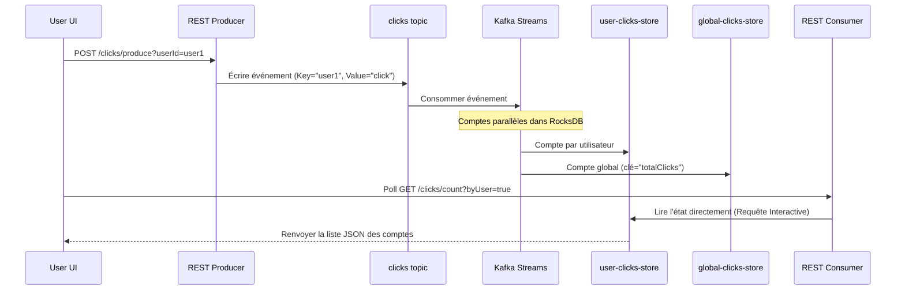

### 2. Comment exécuter
1.  Créer les topics :
    ```bash
    docker exec -it kafka kafka-topics --create --topic clicks --bootstrap-server localhost:9092 --partitions 1 --replication-factor 1
    docker exec -it kafka kafka-topics --create --topic click-counts --bootstrap-server localhost:9092 --partitions 1 --replication-factor 1
    ```
    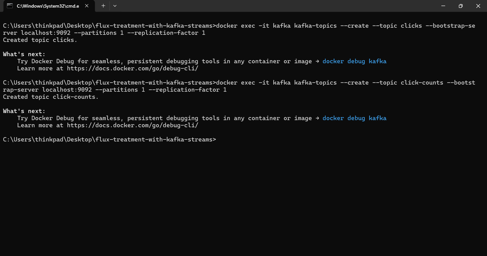
2.  Exécutez l'application [ClickCounterApplication](file:///c:/Users/thinkpad/Desktop/flux-treatment-with-kafka-streams/exercise-3-click-counter/src/main/java/ma/enset/exercise3/ClickCounterApplication.java) dans votre IDE ou votre terminal Maven.
3.  Ouvrez votre navigateur et accédez à :
    ```text
    http://localhost:8080/
    ```
    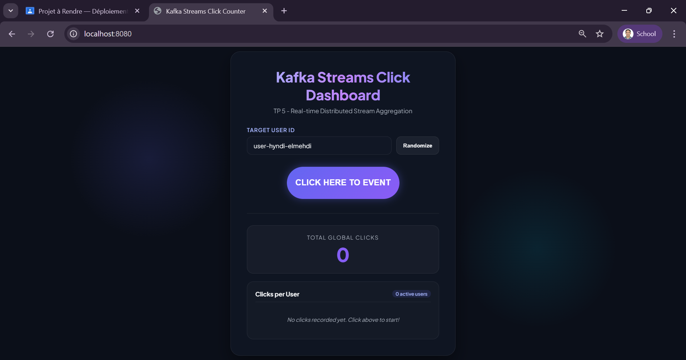
4.  Entrez des identifiants d'utilisateur, cliquez sur le bouton **"CLICK HERE TO EVENT"**, et observez le tableau de bord se mettre à jour en temps réel.
    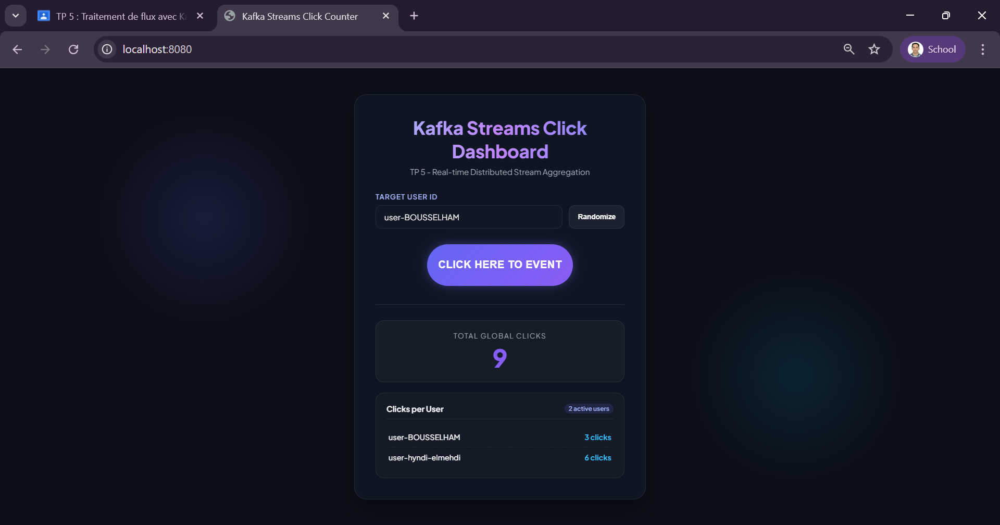
5.  Pour interroger les points d'accès REST manuellement :
    *   **Clics Globaux Totaux :**
        `curl http://localhost:8080/clicks/count`
    *   **Clics par utilisateur :**
        `curl http://localhost:8080/clicks/count?byUser=true`
    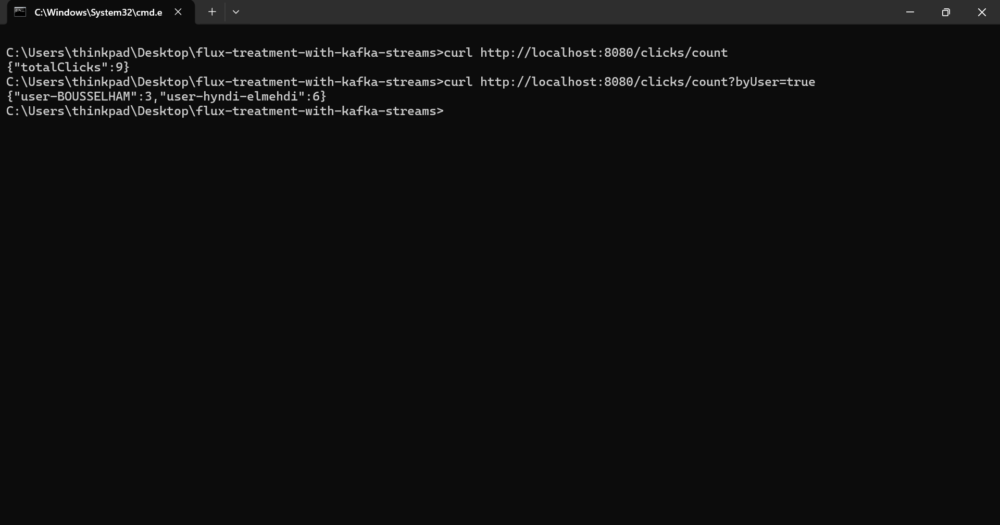

---

## Difficultés rencontrées et Solutions proposées

Lors du développement de ce TP, plusieurs défis techniques ont été résolus :

### 1. Affichage des logs en rouge dans la console (slf4j-simple)
*   **Difficulté :** La dépendance `slf4j-simple` (utilisée dans les exercices 1 et 2) redirige par défaut tous ses logs vers le flux d'erreur standard (`System.err`). Dans IntelliJ IDEA et de nombreux terminaux, cela colore l'intégralité des logs INFO en rouge, laissant penser à un crash de l'application.
*   **Solution :** Ajout d'un bloc d'initialisation statique (`static { ... }`) au sommet des classes [TextCleanerApp.java](file:///c:/Users/thinkpad/Desktop/flux-treatment-with-kafka-streams/exercise-1-text-cleaner/src/main/java/ma/enset/exercise1/TextCleanerApp.java) et [WeatherAnalyzerApp.java](file:///c:/Users/thinkpad/Desktop/flux-treatment-with-kafka-streams/exercise-2-weather-analyzer/src/main/java/ma/enset/exercise2/WeatherAnalyzerApp.java) pour forcer le logger à utiliser le flux de sortie standard (`System.out`) :
    ```java
    System.setProperty("org.slf4j.simpleLogger.logFile", "System.out");
    ```

### 2. Erreurs de permissions sur le répertoire d'état temporaire (Windows)
*   **Difficulté :** Au démarrage de RocksDB pour stocker les états des agrégations, Kafka Streams tente d'appliquer des permissions Unix (POSIX) sur le dossier `C:\Users\...\Temp\kafka-streams`. Sous Windows, cela lève des erreurs `Failed to change permissions`.
*   **Solution :** Après analyse, il a été constaté que RocksDB continue de fonctionner normalement car il dispose des droits d'écriture/lecture de base. Ces erreurs sont des avertissements inoffensifs spécifiques à Windows qui peuvent être ignorés sans impact sur la stabilité du traitement.

### 3. Exception de Topic Source Manquant (`MissingSourceTopicException`)
*   **Difficulté :** Dans l'exercice 3, si l'application Spring Boot démarre alors que le topic de sortie `click-counts` ou le topic d'entrée `clicks` n'a pas été explicitement créé, le processus de rebalance échoue avec une exception bloquante `MissingSourceTopicException` car la création automatique de topics n'est pas activée pour la topologie de streams.
*   **Solution :** Création manuelle et systématique de tous les topics nécessaires à l'aide des commandes d'administration CLI de Kafka avant le démarrage de l'application, puis redémarrage de Spring Boot pour rafraîchir les métadonnées du client.

### 4. Erreurs de Désérialisation avec Jackson
*   **Difficulté :** Lors de la désérialisation des objets JSON reçus dans l'exercice 2, Jackson générait des erreurs d'instanciation car les classes modèles n'avaient que des constructeurs paramétrés.
*   **Solution :** Ajout explicite de constructeurs vides par défaut sans argument (`public WeatherRecord() {}` et `public WeatherAverage() {}`) dans nos modèles pour permettre à la réflexion de Jackson de recréer les instances de classe avant d'y injecter les valeurs via les setters.

